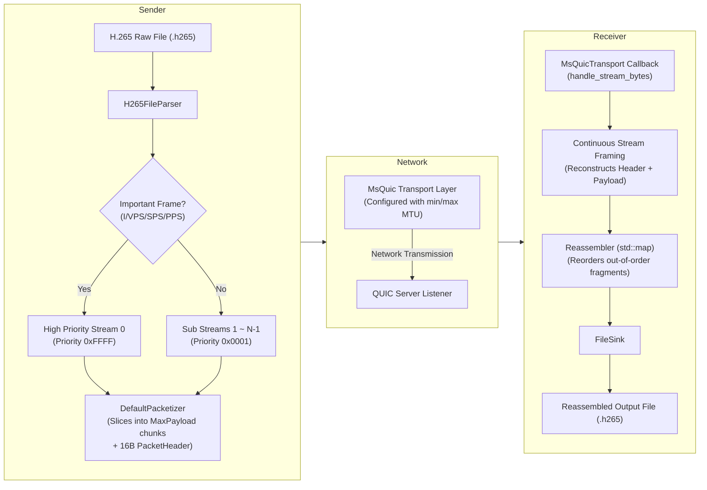

# QUIC Media Transmission System

This is a C++ media streaming prototype designed to transmit raw H.265/HEVC video streams over the QUIC protocol. Built on Microsoft's **MsQuic** library, the project implements custom application-layer fragmentation, multi-stream prioritization, MTU control, and tracking for networking experiments.

---

## System Architecture

The framework is decoupled into a modular architecture:
*   **Media Parser (`H265FileParser`)**: Scans input files for Annex-B start codes (`00 00 01` or `00 00 00 01`) and extracts individual NALUs.
*   **Application Protocol Framing (`PacketHeader` / `DefaultPacketizer`)**: Slices large NALUs into MTU-compliant fragments prepended with a 16-byte aligned packet header.
*   **Priority Scheduler**: Routes critical frames (I-frames, VPS, SPS, PPS) to the high-priority QUIC Stream 0, while spreading standard P/B-frames across sub-streams.
*   **Transport Layer (`MsQuicTransport`)**: Manages the life cycle of MsQuic connections, streams, parameters (such as MTU constraints), and asynchronous I/O callbacks.
*   **Receiver & Reassembler (`Reassembler` / `FileSink`)**: Buffers fragments into a non-blocking map, enforces in-order reassembly of NALUs, and writes finalized streams to output.



---

## Environment Setup & Installation

### 1. Prerequisites
*   Linux OS (Ubuntu 20.04+ recommended)
*   CMake 3.16+
*   Compiled MsQuic and server TLS credentials (e.g. .crt, .key files)

See [docs/INSTALL.md](docs/INSTALL.md) for detailed installation and build instructions for MsQuic and the media system.

### 2. Compilation

If the environment and credentials are ready, configure and compile:
```bash
# From project root directory
cmake -S . -B build \
  -DCMAKE_BUILD_TYPE=Debug \
  -DQUIC_ENABLE_LOGGING=ON \
  -DQUIC_BUILD_TOOLS=ON

cmake --build build -j

```

## Usage Guide

### 1. Run the Server
Start the server listener first to receive the streamed output:
```bash
./moq_server <host> <port> <output.h265/ivf> <cert_file> <key_file> [--min_mtu=N] [--max_mtu=N]
```
*   `--min_mtu=N` / `--max_mtu=N` *(Optional)*: Forces MSQuic to override PMTUD and constrain the wire packet sizes.
*   **Example**:
    ```bash
    ./moq_server 0.0.0.0 4433 output.h265 ../certs/server.crt ../certs/server.key --min_mtu=1300 --max_mtu=1400
    ```
    ```bash
    ./moq_server 0.0.0.0 4433 output.ivf ../certs/server.crt ../certs/server.key
    ```

### 2. Run the Client
Stream the input H.265/IVF file to the server:
```bash
./moq_client <host> <port> <input.h265/ivf> [--streams=N] [--chunksize=N] [--min_mtu=N] [--max_mtu=N]
```
*   `--streams=N` *(Optional)*: The total number of streams to open (Default: `2`, minimum `2` to split priority flows).
*   `--chunksize=N` *(Optional)*: Payload fragment size limit in bytes (Default: `1200`).
*   `--min_mtu=N` / `--max_mtu=N` *(Optional)*: Forces MSQuic to override PMTUD and constrain the wire packet sizes.
*   **Example**:
    ```bash
    ./moq_client localhost 4433 input.ivf --streams=4 --chunksize=800 --min_mtu=1200 --max_mtu=1200
    ```

### 3. Important Notes & Best Practices

*   **Server First, Client Second**: Always start `moq_server` before running `moq_client`. If the server is not listening, the client will immediately fail with a transport connection error (e.g. `status=113`, Connection Refused). *(Note: Automatic reconnection/retry logic may be introduced in future versions).*
*   **Symmetric MTU Configuration**: If you configure `--max_mtu=N` on `moq_client`, **you must also configure `--max_mtu=N` on `moq_server`**. Otherwise, asymmetric MTU discovery settings will cause the QUIC connection handshake or data transfer to stall and eventually error out.
*   **MsQuic MTU Limits**: Ensure any configured MTU values adhere to `1500 >= max_mtu >= min_mtu >= 1248`. Values below `1248` violate QUIC base specifications and will cause `ConfigurationOpen` to fail. If you configure values exceeding the standard Ethernet MTU ceiling of `1500`, MsQuic will not crash but will automatically clamp the MTU back down to `1500` during transmission as a safeguard.
*   **Valid Certificate Paths**: Make sure the server is provided with correct paths to `server.crt` and `server.key`. If either file is missing, the server will fail during initial credential loading (`ConfigurationLoadCredential failed`).
*   **Background Process Cleanup**: When running `moq_server` in the background (`&`), ensure you terminate it (`pkill -f moq_server`) before starting a new test run to prevent `Address already in use` (port `4433` collision) errors.