# ns-3 UDP Simulation Bridge (Installation & Architecture)

This directory contains a bridge system for integrating real-world network applications (like QUIC or standard UDP traffic) into an ns-3 network simulation. It allows real applications to send packets into a simulated ns-3 network topology (with configurable delay, bandwidth, and packet loss) and receive the responses back, effectively subjecting real-world traffic to simulated network conditions.

---

## 🛠️ Installation (ns-3 Dev Version)

To install and configure the ns-3 development environment for use with this simulation bridge:

### Step 1: Clone the ns-3-dev Repository
Clone the latest official development version of ns-3 directly from GitLab:
```bash
git clone https://gitlab.com/nsnam/ns-3-dev.git
cd ns-3-dev
```

### Step 2: Configure and Build ns-3
Configure the build system and compile ns-3 using the native `ns3` wrapper:
```bash
./ns3 configure --enable-examples --enable-tests
./ns3 build
```

### Step 3: Deploy Simulation Scripts
Copy or symlink the `QUIC_sim` folder from this repository into the ns-3 `scratch/` directory (or run directly depending on your ns-3 path configuration):
```bash
cp -r /path/to/QUIC_media_sys/ns3/QUIC_sim scratch/
```

---

## Architecture

The bridge consists of two main components acting as gateways between the OS network stack and the ns-3 simulation environment:

### 1. Overall User-Space Bridge System

```mermaid
flowchart LR
    subgraph RealWorldClient ["Real-World Environment"]
        QC["QUIC Client<br>(moq_client)"]
    end

    subgraph BridgeSystem ["User-Space Bridge System (ns-3 RealtimeSimulator)"]
        CB["ClientBridge App<br>(Client-side Proxy)"]
        NS3(("ns-3 Simulation Engine<br>RealtimeSimulator"))
        SB["ServerBridge App<br>(Server-side Proxy)"]

        CB -- "Forward Transmission<br>[Raw Payload (Port 1000 -> 9999)]" --> NS3
        NS3 -- "Arrive after Virtual Delay" --> SB

        SB -- "Reverse Transmission<br>[Raw ACK (Port 9999 -> 1000)]" --> NS3
        NS3 -- "Return after Virtual Delay" --> CB
    end

    subgraph RealWorldServer ["Real-World Environment"]
        QS["QUIC Server<br>(moq_server)"]
    end

    QC -- "1. Original QUIC Packet<br>(Port 8000)" --> CB
    SB -- "2. Restored QUIC Packet<br>(Sent via OS NAT Socket)" --> QS
    QS -- "3. ACK Packet Reply<br>(Returned to OS NAT Socket)" --> SB
    CB -- "4. Pure ACK Returned<br>(Via stored client_addr_)" --> QC

    classDef real fill:#f1f5f9,stroke:#64748b,stroke-width:2px,color:#0f172a;
    classDef app fill:#e0f2fe,stroke:#0284c7,stroke-width:2px,color:#0f172a;
    classDef sim fill:#fff7ed,stroke:#ea580c,stroke-width:2px,color:#0f172a,stroke-dasharray: 5 5;

    class QC,QS real;
    class CB,SB app;
    class NS3 sim;
```



---

### 2. Forward Path (C to S: Client ➔ ClientBridge ➔ ns-3 ➔ ServerBridge ➔ Server)

```mermaid
flowchart LR
    subgraph ClientWorld ["1. Physical Client"]
        direction TB
        QC["QUIC Client<br>(moq_client)"]
    end

    subgraph ClientBridge ["2. ClientBridgeApp (Node 0)"]
        direction TB
        CB_PR["PhysicalRecvLoop()<br>• recvfrom(OS Port 8000)<br>• Caches client_addr_<br>• tx_packets_++"] --> CB_INJ["InjectToNs3(data)<br>• Creates ns3::Packet<br>• Send() via Virtual Port 1000"]
    end

    subgraph NS3Engine ["3. ns-3 Simulation Engine"]
        direction TB
        NS3_NET(("ns-3 RealtimeSimulator<br>• Channel Delay (5ms)<br>• Virtual Port 1000 ➔ 9999"))
    end

    subgraph ServerBridge ["4. ServerBridgeApp (Node 1)"]
        direction TB
        SB_RX["ReceiveFromNs3(socket)<br>• RecvFrom(Virtual Port 9999)<br>• rx_packets_++<br>• Parses 'from' to InetSocketAddress"] --> SB_NAT["NAT Table Lookup<br>• Derives client_key<br>• Assigns dedicated OS socket<br>• Spawns ServerRecvLoop"] --> SB_SND["sendto(127.0.0.1:4433)<br>• Forwards clean raw payload"]
    end

    subgraph ServerWorld ["5. Physical Server"]
        direction TB
        QS["QUIC Server<br>(moq_server listening on 4433)"]
    end

    QC -- "1. UDP Packet<br>(OS Port 8000)" --> CB_PR
    CB_INJ -- "2. ns3::Packet<br>(Virtual Port 1000)" --> NS3_NET
    NS3_NET -- "3. Simulated Packet<br>(Virtual Port 9999)" --> SB_RX
    SB_SND -- "4. Raw Payload<br>(OS NAT Socket ➔ 4433)" --> QS

    classDef real fill:#f1f5f9,stroke:#64748b,stroke-width:2px,color:#0f172a;
    classDef app fill:#e0f2fe,stroke:#0284c7,stroke-width:2px,color:#0f172a;
    classDef sim fill:#fff7ed,stroke:#ea580c,stroke-width:2px,color:#0f172a;
    classDef inner fill:#f8fafc,stroke:#3b82f6,stroke-width:1px,color:#1e293b;

    class QC,QS real;
    class ClientBridge,ServerBridge app;
    class NS3_NET sim;
    class CB_PR,CB_INJ,SB_RX,SB_NAT,SB_SND inner;
```



---

### 3. Return Path (S to C: Server ➔ ServerBridge ➔ ns-3 ➔ ClientBridge ➔ Client)

```mermaid
flowchart LR
    subgraph ServerWorld ["1. Physical Server"]
        direction TB
        QS["QUIC Server<br>(moq_server)"]
    end

    subgraph ServerBridge ["2. ServerBridgeApp (Node 1)"]
        direction TB
        SB_SRV_RX["ServerRecvLoop(fd, dest)<br>• recv(Dedicated OS NAT socket)<br>• tx_packets_++"] --> SB_INJ["InjectToNs3(data, dest)<br>• Creates ns3::Packet<br>• SendTo(dest) towards Virtual Port 1000"]
    end

    subgraph NS3Engine ["3. ns-3 Simulation Engine"]
        direction TB
        NS3_NET(("ns-3 RealtimeSimulator<br>• Channel Delay (5ms)<br>• Virtual Port 9999 ➔ 1000"))
    end

    subgraph ClientBridge ["4. ClientBridgeApp (Node 0)"]
        direction TB
        CB_RX["ReceiveFromNs3(socket)<br>• RecvFrom(Virtual Port 1000)<br>• rx_packets_++"] --> CB_SND["sendto(client_addr_)<br>• Forwards clean raw payload<br>to cached client_addr_"]
    end

    subgraph ClientWorld ["5. Physical Client"]
        direction TB
        QC["QUIC Client<br>(moq_client)"]
    end

    QS -- "1. Server Response<br>(OS NAT Socket)" --> SB_SRV_RX
    SB_INJ -- "2. ns3::Packet<br>(Virtual Port 9999)" --> NS3_NET
    NS3_NET -- "3. Simulated Packet<br>(Virtual Port 1000)" --> CB_RX
    CB_SND -- "4. Pure ACK<br>(OS Port 8000 ➔ Client)" --> QC

    classDef real fill:#f1f5f9,stroke:#64748b,stroke-width:2px,color:#0f172a;
    classDef app fill:#e0f2fe,stroke:#0284c7,stroke-width:2px,color:#0f172a;
    classDef sim fill:#fff7ed,stroke:#ea580c,stroke-width:2px,color:#0f172a;
    classDef inner fill:#f8fafc,stroke:#10b981,stroke-width:1px,color:#1e293b;

    class QC,QS real;
    class ClientBridge,ServerBridge app;
    class NS3_NET sim;
    class SB_SRV_RX,SB_INJ,CB_RX,CB_SND inner;
```




1. **ClientBridgeApp (`QUIC_sim/client_bridge.cc`) - Client Side Proxy:**
   - **`Setup()`**: Initializes bridge configuration, assigning the real OS UDP listening port (`8000 + i`) and the ns-3 virtual port (`1000 + i`).
   - **`StartApplication()`**: Sets up the ns-3 virtual socket listener and spawns a dedicated background thread running `PhysicalRecvLoop()`.
   - **`PhysicalRecvLoop()`**: Uses `recvfrom()` to intercept UDP packets sent by local real-world client applications. Caches the physical client's `sockaddr_in` in memory (operating entirely without custom headers).
   - **`InjectToNs3()`**: Wraps the intercepted raw payload into an `ns3::Packet` and injects it into the ns-3 simulation network via virtual port `1000 + i`.
   - **`ReceiveFromNs3()`**: Listens on virtual port `1000 + i` for return packets emerging from ns-3 and uses `sendto()` to forward the pure payload back to the cached real-world client app.
   - **`StopApplication()`**: Automatically triggered upon simulation end time or `Ctrl + Z` or `Ctrl + C`, terminating running threads and printing the atomic packet ingress/egress statistics (`tx_packets_` and `rx_packets_`).

2. **ServerBridgeApp (`QUIC_sim/server_bridge.cc`) - Server Side Proxy:**
   - **`Setup()`**: Configures the virtual listening port (`9999 + i`) and the target real server destination port (usually `4433 + i`).
   - **`StartApplication()`**: Creates the ns-3 virtual socket and binds the receive callback to `ReceiveFromNs3()`.
   - **`ReceiveFromNs3()`**: Listens on virtual port `9999 + i` for packets emerging from the ns-3 simulation network. Uses the simulated ns-3 origin address (`ns3::InetSocketAddress`) as the NAT mapping key. If it is a new client, it allocates a dedicated OS socket and spawns `ServerRecvLoop()`; it then uses `sendto()` to forward the pure payload to the real server (`127.0.0.1:4433 + i`).
   - **`ServerRecvLoop()`**: Runs in a dedicated thread using `recv()` to listen for response packets from the real server, calling `InjectToNs3()` upon packet arrival.
   - **`InjectToNs3()`**: Wraps the server's response payload into an `ns3::Packet` and injects it back into ns-3 towards the original `ClientBridgeApp`.
   - **`StopApplication()`**: Automatically triggered upon simulation end time or `Ctrl + Z` or `Ctrl + C`, closing all active OS sockets in the NAT table and printing atomic packet ingress/egress statistics (`tx_packets_` and `rx_packets_`).

3. **Simulation Topology (`QUIC_sim/two_router_udp.cc`):**
   - **`main()`**: Sets up the simulated ns-3 environment (typically Hosts -> Routers -> Hosts) and configures network characteristics (e.g., 10Mbps bandwidth, 5ms delay, and configurable packet loss rate).
   - **`ns3::RealtimeSimulatorImpl`**: Switches the simulation engine to real-time mode, synchronizing the virtual simulation clock with the OS wall-clock time to enable live packet interaction.
   - **`ClientBridgeApp / ServerBridgeApp Installation`**: Installs and binds the bridge applications onto the simulated nodes to bridge traffic.
   - **`ns3::FlowMonitor`**: Collects network-level FlowMonitor statistics and outputs final packet counts when the simulation stops.

## File Structure

- `QUIC_sim/two_router_udp.cc`: The main ns-3 simulation script that sets up the topology and bridges.
- `QUIC_sim/client_bridge.cc`: The client-side bridge application source.
- `QUIC_sim/server_bridge.cc`: The server-side bridge application source.
- `QUIC_sim/lib/client_bridge.h`: Header for `ClientBridgeApp`.
- `QUIC_sim/lib/server_bridge.h`: Header for `ServerBridgeApp`.
- `QUIC_sim/lib/nat_header.h`: Legacy definition of `NatHeader` (currently commented out/disabled to enable pure zero-overhead payload routing).

## How to Run

> 👉 **For dedicated step-by-step end-to-end testing instructions with `moq_client` and `moq_server` on localhost, please refer to:**
> *   **[TESTING_ZH.md (中文本地實測指南)](TESTING_ZH.md)**
> *   **[TESTING.md (English Localhost Testing Guide)](TESTING.md)**

You can execute the simulation using ns-3's waf or ns3 runner. To enable the real-time interaction, the simulator uses `ns3::RealtimeSimulatorImpl`.

```bash
# Example running inside an ns-3 environment:
./ns3 run "QUIC_sim/two_router_udp --errorRate=0.01 --dataRate=10Mbps --delay=5ms --numClients=3"
```

### Parameters:
- `--errorRate`: Packet loss rate (default: 0.0)
- `--dataRate`: Link bandwidth (default: "10Mbps")
- `--delay`: Link delay (default: "5ms")
- `--numClients`: Number of parallel client-server bridge pairs to instantiate (default: 3)

### Port Mapping (Example with `numClients=3`)
- **Client Entry Ports (Real OS):** 8000, 8001, 8002
- **Ns-3 Client Virtual Ports:** 1000, 1001, 1002
- **Ns-3 Server Virtual Ports:** 9999, 10000, 10001
- **Server Destination Ports (Real OS):** 4433, 4434, 4435

Real client apps should send traffic to `127.0.0.1:8000`, which will be bridged through ns-3 (via virtual ports `1000` -> `9999`) and delivered to a real server listening on `127.0.0.1:4433`.
