# ns-3 UDP 模擬橋接系統 (安裝與架構指引)

本目錄包含一套專門將真實世界網路應用程式（如 QUIC 或標準 UDP 流量）整合進 ns-3 網路模擬環境的橋接系統 (Bridge System)。透過這套系統，實體應用程式能將封包傳入 ns-3 模擬拓撲中（具備可自訂的延遲、頻寬限制與封包遺失率），並接收返回的封包，藉此在高度擬真的受控模擬網路下評估程式表現。

---

## 🛠️ ns-3 開發版 (Dev) 安裝方式

若要在本機配置 ns-3 開發版環境以運行本橋接系統，請依照以下步驟進行：

### 步驟 1：取得 ns-3-dev 原始碼
使用 git clone 直接抓取 GitLab 上的官方最新開發版 (dev) 原始碼：
```bash
git clone https://gitlab.com/nsnam/ns-3-dev.git
cd ns-3-dev
```

### 步驟 2：配置與編譯 ns-3
使用 ns-3 內建的編譯封裝程式進行設定與編譯：
```bash
./ns3 configure --enable-examples --enable-tests
./ns3 build
```

### 步驟 3：部署模擬器腳本
將本專案內的 `QUIC_sim` 模組資料夾複製或軟連結至 ns-3 的 `scratch/` 目錄下：
```bash
cp -r /path/to/QUIC_media_sys/ns3/QUIC_sim scratch/
```

---

## 系統核心架構

本橋接系統由兩個主要核心模組構成，作為作業系統 (OS) 網路堆疊與 ns-3 模擬器之間的閘道器：

### 1. User-Space Bridge 系統整體架構

```mermaid
flowchart LR
    subgraph RealWorldClient ["Real-World Environment"]
        QC["QUIC Client<br>(moq_client)"]
    end

    subgraph BridgeSystem ["User-Space Bridge System (ns-3 RealtimeSimulator)"]
        CB["ClientBridge App<br>(Client-side Proxy)"]
        NS3(("ns-3 Simulation Engine<br>RealtimeSimulator"))
        SB["ServerBridge App<br>(Server-side Proxy)"]

        CB -- "Forward Transmission<br>[Raw Payload (Port 1000 -> 9999)]" --> NS3
        NS3 -- "Arrive after Virtual Delay" --> SB

        SB -- "Reverse Transmission<br>[Raw ACK (Port 9999 -> 1000)]" --> NS3
        NS3 -- "Return after Virtual Delay" --> CB
    end

    subgraph RealWorldServer ["Real-World Environment"]
        QS["QUIC Server<br>(moq_server)"]
    end

    QC -- "1. Original QUIC Packet<br>(Port 8000)" --> CB
    SB -- "2. Restored QUIC Packet<br>(Sent via OS NAT Socket)" --> QS
    QS -- "3. ACK Packet Reply<br>(Returned to OS NAT Socket)" --> SB
    CB -- "4. Pure ACK Returned<br>(Via stored client_addr_)" --> QC

    classDef real fill:#f1f5f9,stroke:#64748b,stroke-width:2px,color:#0f172a;
    classDef app fill:#e0f2fe,stroke:#0284c7,stroke-width:2px,color:#0f172a;
    classDef sim fill:#fff7ed,stroke:#ea580c,stroke-width:2px,color:#0f172a,stroke-dasharray: 5 5;

    class QC,QS real;
    class CB,SB app;
    class NS3 sim;
```



---

### 2. 封包去程路徑 (Client ➔ ClientBridge ➔ ns-3 ➔ ServerBridge ➔ Server)

```mermaid
flowchart LR
    subgraph ClientWorld ["1. Physical Client"]
        direction TB
        QC["QUIC Client<br>(moq_client)"]
    end

    subgraph ClientBridge ["2. ClientBridgeApp (Node 0)"]
        direction TB
        CB_PR["PhysicalRecvLoop()<br>• recvfrom(OS Port 8000)<br>• Caches client_addr_<br>• tx_packets_++"] --> CB_INJ["InjectToNs3(data)<br>• Creates ns3::Packet<br>• Send() via Virtual Port 1000"]
    end

    subgraph NS3Engine ["3. ns-3 Simulation Engine"]
        direction TB
        NS3_NET(("ns-3 RealtimeSimulator<br>• Channel Delay (5ms)<br>• Virtual Port 1000 ➔ 9999"))
    end

    subgraph ServerBridge ["4. ServerBridgeApp (Node 1)"]
        direction TB
        SB_RX["ReceiveFromNs3(socket)<br>• RecvFrom(Virtual Port 9999)<br>• rx_packets_++<br>• Parses 'from' to InetSocketAddress"] --> SB_NAT["NAT Table Lookup<br>• Derives client_key<br>• Assigns dedicated OS socket<br>• Spawns ServerRecvLoop"] --> SB_SND["sendto(127.0.0.1:4433)<br>• Forwards clean raw payload"]
    end

    subgraph ServerWorld ["5. Physical Server"]
        direction TB
        QS["QUIC Server<br>(moq_server listening on 4433)"]
    end

    QC -- "1. UDP Packet<br>(OS Port 8000)" --> CB_PR
    CB_INJ -- "2. ns3::Packet<br>(Virtual Port 1000)" --> NS3_NET
    NS3_NET -- "3. Simulated Packet<br>(Virtual Port 9999)" --> SB_RX
    SB_SND -- "4. Raw Payload<br>(OS NAT Socket ➔ 4433)" --> QS

    classDef real fill:#f1f5f9,stroke:#64748b,stroke-width:2px,color:#0f172a;
    classDef app fill:#e0f2fe,stroke:#0284c7,stroke-width:2px,color:#0f172a;
    classDef sim fill:#fff7ed,stroke:#ea580c,stroke-width:2px,color:#0f172a;
    classDef inner fill:#f8fafc,stroke:#3b82f6,stroke-width:1px,color:#1e293b;

    class QC,QS real;
    class ClientBridge,ServerBridge app;
    class NS3_NET sim;
    class CB_PR,CB_INJ,SB_RX,SB_NAT,SB_SND inner;
```



---

### 3. 封包回程路徑 (Server ➔ ServerBridge ➔ ns-3 ➔ ClientBridge ➔ Client)

```mermaid
flowchart LR
    subgraph ServerWorld ["1. Physical Server"]
        direction TB
        QS["QUIC Server<br>(moq_server)"]
    end

    subgraph ServerBridge ["2. ServerBridgeApp (Node 1)"]
        direction TB
        SB_SRV_RX["ServerRecvLoop(fd, dest)<br>• recv(Dedicated OS NAT socket)<br>• tx_packets_++"] --> SB_INJ["InjectToNs3(data, dest)<br>• Creates ns3::Packet<br>• SendTo(dest) towards Virtual Port 1000"]
    end

    subgraph NS3Engine ["3. ns-3 Simulation Engine"]
        direction TB
        NS3_NET(("ns-3 RealtimeSimulator<br>• Channel Delay (5ms)<br>• Virtual Port 9999 ➔ 1000"))
    end

    subgraph ClientBridge ["4. ClientBridgeApp (Node 0)"]
        direction TB
        CB_RX["ReceiveFromNs3(socket)<br>• RecvFrom(Virtual Port 1000)<br>• rx_packets_++"] --> CB_SND["sendto(client_addr_)<br>• Forwards clean raw payload<br>to cached client_addr_"]
    end

    subgraph ClientWorld ["5. Physical Client"]
        direction TB
        QC["QUIC Client<br>(moq_client)"]
    end

    QS -- "1. Server Response<br>(OS NAT Socket)" --> SB_SRV_RX
    SB_INJ -- "2. ns3::Packet<br>(Virtual Port 9999)" --> NS3_NET
    NS3_NET -- "3. Simulated Packet<br>(Virtual Port 1000)" --> CB_RX
    CB_SND -- "4. Pure ACK<br>(OS Port 8000 ➔ Client)" --> QC

    classDef real fill:#f1f5f9,stroke:#64748b,stroke-width:2px,color:#0f172a;
    classDef app fill:#e0f2fe,stroke:#0284c7,stroke-width:2px,color:#0f172a;
    classDef sim fill:#fff7ed,stroke:#ea580c,stroke-width:2px,color:#0f172a;
    classDef inner fill:#f8fafc,stroke:#10b981,stroke-width:1px,color:#1e293b;

    class QC,QS real;
    class ClientBridge,ServerBridge app;
    class NS3_NET sim;
    class SB_SRV_RX,SB_INJ,CB_RX,CB_SND inner;
```



1. **ClientBridgeApp (`QUIC_sim/client_bridge.cc`) - 用戶端中繼：**
   - **`Setup()`**：初始化中繼設定，指定監聽的實體 OS UDP 連接埠 (`8000 + i`) 與 ns-3 虛擬連接埠 (`1000 + i`)。
   - **`StartApplication()`**：建立 ns-3 虛擬 Socket 監聽，並啟動獨立執行緒執行 `PhysicalRecvLoop()`。
   - **`PhysicalRecvLoop()`**：利用系統呼叫 `recvfrom()` 攔截本機用戶端應用程式送出的 UDP 封包，並在記憶體中快取實體 Client 的 `sockaddr_in`（全程不需安插任何額外的自訂表頭）。
   - **`InjectToNs3()`**：將攔截到的純粹載荷打包成 `ns3::Packet`，經由虛擬連接埠 `1000 + i` 注入 ns-3 模擬拓撲中。
   - **`ReceiveFromNs3()`**：監聽虛擬連接埠 `1000 + i` 接收自 ns-3 模擬拓撲返回的封包，並透過系統呼叫 `sendto()` 將純粹的載荷送回先前快取的實體 Client。
   - **`StopApplication()`**：於模擬時間截止或使用者按 `Ctrl + Z` 或 `Ctrl + C` 終止時自動觸發，清理執行緒並在結束時匯總輸出統計的進出封包數量 (`tx_packets_` 與 `rx_packets_`)。

2. **ServerBridgeApp (`QUIC_sim/server_bridge.cc`) - 伺服器端中繼：**
   - **`Setup()`**：設定虛擬連接埠 (`9999 + i`) 與目標本機實體 Server 埠號（通常為 `4433 + i`）。
   - **`StartApplication()`**：建立 ns-3 虛擬 Socket，設定封包接收回調函式指向 `ReceiveFromNs3()`。
   - **`ReceiveFromNs3()`**：監聽虛擬連接埠 `9999 + i` 接收來自 ns-3 模擬拓撲的封包。將模擬的 ns-3 來源地址 (`ns3::InetSocketAddress`) 作為 NAT 對應金鑰。若為新連線，則建立專屬 OS Socket 並啟動獨立執行緒執行 `ServerRecvLoop()`；隨後透過 `sendto()` 將乾淨的載荷轉發至本機實體 Server (`127.0.0.1:4433 + i`)。
   - **`ServerRecvLoop()`**：於獨立執行緒中利用 `recv()` 監聽實體 Server 回傳的回應封包，收到後呼叫 `InjectToNs3()`。
   - **`InjectToNs3()`**：將 Server 回傳的載荷建立為 `ns3::Packet`，朝原來的 `ClientBridgeApp` 虛擬位址注回 ns-3 模擬網路。
   - **`StopApplication()`**：於模擬終止時自動觸發，關閉 NAT 表內所有 Socket，並匯總輸出統計進出封包數量 (`tx_packets_` 與 `rx_packets_`)。

3. **模擬拓撲 (`QUIC_sim/two_router_udp.cc`)：**
   - **`main()`**：建構 ns-3 模擬拓撲環境（通常為 Host -> Router -> Host），設定網路特徵（例如 10Mbps 頻寬、5ms 延遲及可調整的封包遺失率）。
   - **`ns3::RealtimeSimulatorImpl`**：切換模擬核心為即時模式，將模擬時鐘與實體作業系統時間對齊，實現即時封包中繼。
   - **`ClientBridgeApp / ServerBridgeApp 安裝`**：將橋接應用程式綁定至虛擬拓撲節點。
   - **`ns3::FlowMonitor`**：收集並監控整體的網路層傳輸統計，並在模擬結束時輸出封包統計數據。

## 檔案結構

- `QUIC_sim/two_router_udp.cc`：主 ns-3 模擬腳本，負責設定拓撲與啟動中繼橋接。
- `QUIC_sim/client_bridge.cc`：用戶端中繼橋接原始碼。
- `QUIC_sim/server_bridge.cc`：伺服器端中繼橋接原始碼。
- `QUIC_sim/lib/client_bridge.h`：`ClientBridgeApp` 標頭檔。
- `QUIC_sim/lib/server_bridge.h`：`ServerBridgeApp` 標頭檔。
- `QUIC_sim/lib/nat_header.h`：舊版 `NatHeader` 定義（目前已停用，改採無開銷純載荷轉發機制）。

## 執行方式總覽

> 👉 **關於本機使用 `moq_client` 與 `moq_server` 搭配 ns-3 進行端到端測試的詳細執行步驟，請詳閱：**
> *   **[TESTING_ZH.md (中文本地實測指南)](TESTING_ZH.md)**
> *   **[TESTING.md (English Localhost Testing Guide)](TESTING.md)**

您可使用 ns-3 內建的 runner 執行腳本。為實現即時封包互動，底層核心會切換至 `ns3::RealtimeSimulatorImpl`。

```bash
# 位於 ns-3 根目錄下執行：
./ns3 run "QUIC_sim/two_router_udp --errorRate=0.01 --dataRate=10Mbps --delay=5ms --numClients=3"
```

### 可調整參數：
- `--errorRate`：封包遺失率（預設：0.0）
- `--dataRate`：連線頻寬限制（預設："10Mbps"）
- `--delay`：通道單向延遲（預設："5ms"）
- `--numClients`：同時建立的平行 Client-Server 橋接配對數（預設：3）

### 連接埠對應 (以 `numClients=3` 為例)
- **Client 入口連線埠 (實體 OS)：** 8000, 8001, 8002
- **ns-3 Client 虛擬埠：** 1000, 1001, 1002
- **ns-3 Server 虛擬埠：** 9999, 10000, 10001
- **Server 目標連線埠 (實體 OS)：** 4433, 4434, 4435

實體 Client 程式將封包發送至 `127.0.0.1:8000`，由 ns-3 橋接轉發（經虛擬連接埠 `1000` -> `9999`），最終準確送達監聽於 `127.0.0.1:4433` 的實體 Server。
